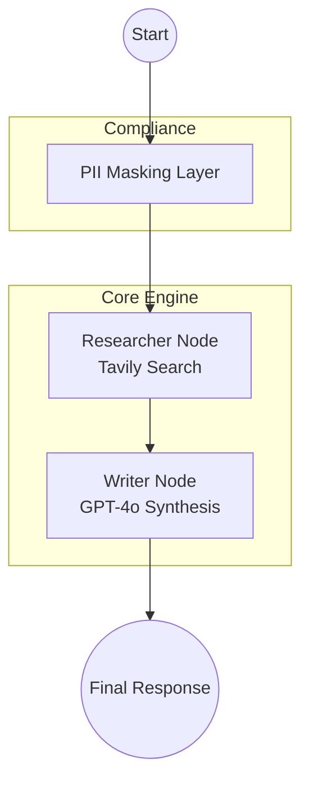

# AgenticFlow-Core — Multi-Agent Research & Synthesis Engine


**Enterprise-ready autonomous agent workflow built with LangGraph and FastAPI.**

---

## 🏛 Architecture

The system utilizes a directed acyclic graph (DAG) to orchestrate specialized agents.



## 🚀 Key Features

- **Multi-Agent Orchestration**: Powered by LangGraph for predictable, stateful agent transitions.
- **GDPR-Ready PII Masking**: Automated detection and masking of sensitive data (Emails, Phones) before processing.
- **Hybrid Research**: Real-time web search integrated via Tavily API for factual grounding.
- **API-First Design**: Built with FastAPI for high performance and easy integration.
- **Structured Logging**: JSON-based logging with `structlog` for production monitoring.

## 🧠 Design Decisions

- **LangGraph**: Chosen for its fine-grained control over agent states and cycles compared to traditional linear chains. See [ADR 003](docs/adr/003-state-management.md).
- **FastAPI**: Selected for its asynchronous capabilities and native Pydantic support, essential for high-concurrency agentic workflows.
- **Tavily**: Used as the primary research engine due to its AI-optimized search results. See [ADR 004](docs/adr/004-tool-integration.md).

## 🛠 Quick Start

### Prerequisites
- Docker & Docker Compose
- API Keys: OpenAI, Tavily

### Installation
1. Clone the repository.
2. Create a `.env` file from `.env.example`:
   ```bash
   cp .env.example .env
   # Add your API keys to .env
   ```
3. Boot the system:
   ```bash
   docker compose up --build -d
   ```

### Testing the API
```bash
curl -X POST http://localhost:8000/chat \
     -H "Content-Type: application/json" \
     -d '{"query": "What are the latest trends in Agentic AI for 2024?", "max_rounds": 5}'
```

## ✅ Quality Assurance

- **Comprehensive Testing**: The project includes Unit, Integration, and End-to-End (E2E) tests ensuring every layer is functional. Run them with `pytest`.
- **Automated CI**: Protected by GitHub Actions. Every push and pull request triggers an automated test suite to prevent regressions.
- **Observability**: Built-in structured JSON logging for real-time monitoring and debugging in production environments.

## ⚖ Compliance & Safety

- **Data Privacy**: All user inputs pass through a regex-based masking layer to prevent PII leakage to LLM providers.
- **Isolation**: Each request runs in an isolated state graph, ensuring no data cross-contamination between sessions.

---
Built with ❤️ for modern business automation.
